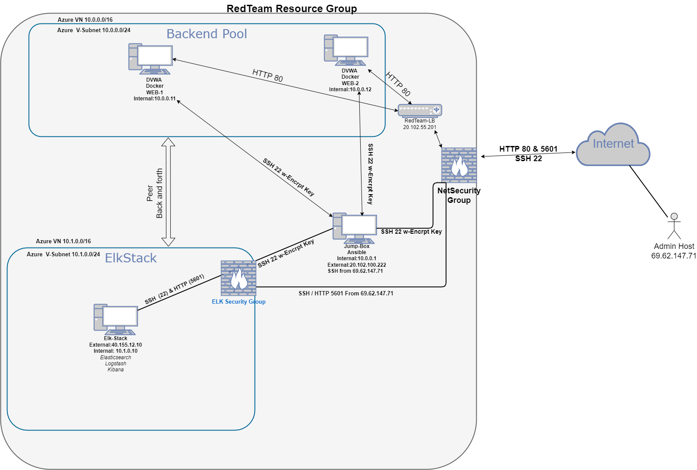

## Automated ELK Stack Deployment

The files in this repository were used to configure the network depicted below.

These files have been tested and used to generate a live ELK deployment on Azure. They can be used to either recreate the entire deployment pictured above. Alternatively, select portions of the YML file may be used to install only certain pieces of it, such as Filebeat.

[Elk Stack Playbook](Ansible/Elk-Install.yml)  
[Filebeat Playbook](Ansible/filebeat.yml)  
[Metricbeat Playbook](Ansible/metricbeat-install.yml) 

This document contains the following details:
- Description of the Topologu
- Access Policies
- ELK Configuration
  - Beats in Use
  - Machines Being Monitored
- How to Use the Ansible Build

### Description of the Topology

The main purpose of this network is to expose a load-balanced and monitored instance of DVWA, the D*mn Vulnerable Web Application.

Load balancing ensures that the application will be highly efficient over the two pooled VM's, in addition to restricting access to the network.
- Load balancing helps the pooled resources balance incoming data between the pooled servers as well as possibly preventing a DOS attack.  
- The jumpbox allows access to the internal servers without exposing ports to the public network. 

Integrating an ELK server allows users to easily monitor the vulnerable VMs for changes to the logs and system metrics.

- Filebeat watch filesystem logs for changes in files when they occur.
- Metricbeat logs service statistics to a file you specify.

The configuration details of each machine may be found below.

| Name     | Function     | IP Address | Operating System |
|----------|--------------|------------|------------------|
| Jump-Box | Gateway      | 10.0.0.1   |  Linux          |
| Web-1    | VM Webserver | 10.0.0.11  |  Linux          |
| Web-2    | VM Webserver | 10.0.0.12  |  Linux          |
| ELK-Stack| ELK Server   | 10.1.0.10  |  Linux          |

### Access Policies

The machines on the internal network are not exposed to the public Internet. 

Only the Jump-Box machine can accept connections from the Internet. Access to this machine is only allowed from the following IP addresses:
- Host Machine 69.62.147.71 with the matching encryption key

Machines within the network can only be accessed by Jump-Box or other VM's inside the network.
- Machine allowed to access the ELK-Stack is the Jump-box with IP 10.0.0.1 over SSH as well as Host IP address through HTTP port 5601

A summary of the access policies in place can be found in the table below.

| Name         | Publicly Accessible | Allowed IP Addresses    |
|--------------|---------------------|-------------------------|
| Jump Box     | Yes                 | 69.62.147.71            |
|Web-1         | No                  |  10.0.0.8               |
|Web-2         | No                  |  10.0.0.9               |
|Elk-Stack     | Yes                 | 10.0.0.1 & 69.62.147.71 |

### Elk Configuration

Ansible was used to automate configuration of the ELK machine. No configuration was performed manually, which is advantageous because it allows for quick uniform deployment and quick changes by tweaking the yml file. 

The playbook implements the following tasks:
- 1 Install container docker.io 
- 2 Install python Library
- 3 Insytall docker module 
- 4 Increase virtual memory
- 5 Launch ELK and publish ports
- 6 Enable service on boot

The following screenshot displays the result of running `docker ps` after successfully configuring the ELK instance.

N/A

### Target Machines & Beats
This ELK server is configured to monitor the following machines:
| Name     | Function         | IP Address   |
|----------|------------------|--------------|
| Web-1    | VM Server        | 10.0.0.11     |
| Web-2    | VM Serve         | 10.0.0.12    |

We have installed the following Beats on these machines:
* Filebeat
* Metricbeat

These Beats allow us to collect the following information from each machine:
- Filebeat: Filebeat is designed to send log files you specify to Logstach for processing or into Elasticsearch for parsing. filebeat searches for log files in /var/log/apache2/*

- Metricbeat: Metricbeat collects metrics and statistics from servers and their services running  and forward them to Elasticsearch or any other location specified. 

### Using the Playbook
In order to use the playbook, you will need to have an Ansible control node already configured. Assuming you have such a control node provisioned: 

SSH into the control node and follow the steps below:
- Copy the filebeat.yml file to /etc/ansible/files/.
- Update the hosts file under [webservers] to include the Internal IP addresses of your webservers 
- Run the playbook, and navigate to Kibana http://[Elk IP address]5601/app/kibana to check that the installation worked as expected.

Answer the following questions to fill in the blanks:

Which file is the playbook? Where do you copy it?
- Elk-playbook.yml  in  /etc/ansible

Which file do you update to make Ansible run the playbook on a specific machine? 
 - hosts.cfg specify the IP address of the machines you want it installed on

How do I specify which machine to install the ELK server on versus which to install Filebeat on?_
 - in the hosts file you can specify what the IP address of the machines you want it installed on

Which URL do you navigate to in order to check that the ELK server is running?
 - http://publicIP(elkserver):5601

_As a **Bonus**, provide the specific commands the user will need to run to download the playbook, update the files, etc._

